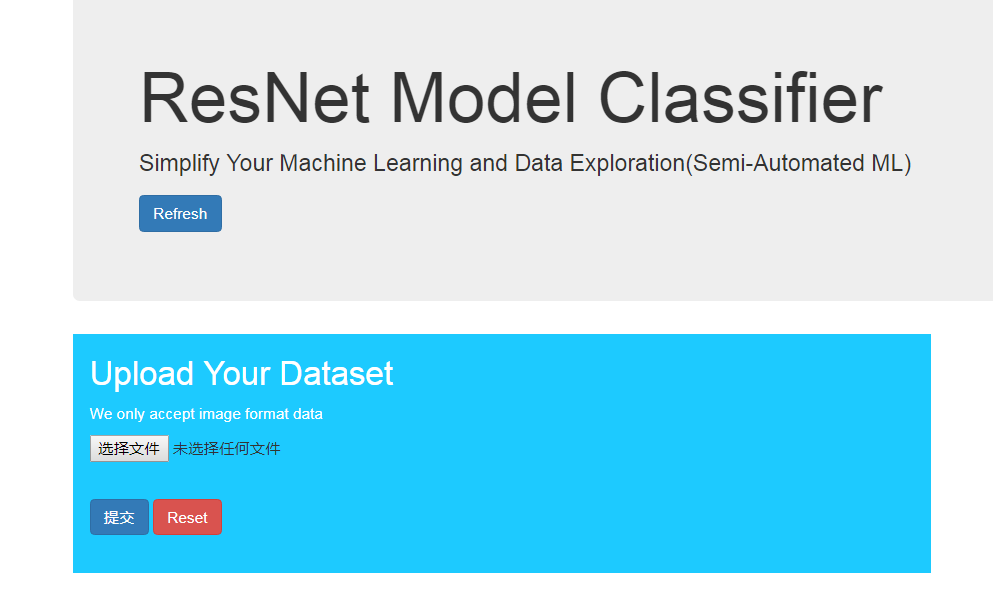
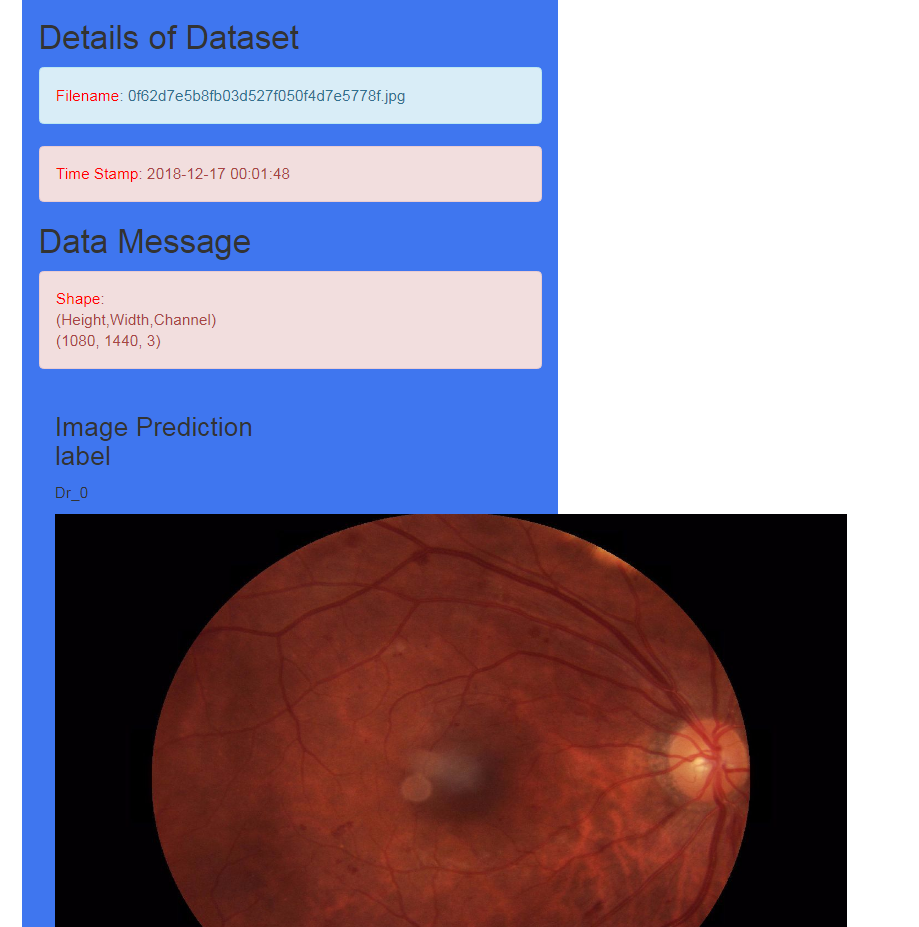

# Flask-Web-In-DL-Classifier

### Flask框架在深度学习的简单应用(真的简单，纯粹扯淡)
* pretrained-model
训练好的模型先放在**checkpoint**文件夹里

* 执行以下代码即可
```python 
python app.py
```


* 以下代码保证每次分类上传的图片时保存下来(保存在static文件夹，static很重要啊)
```python
if request.method=="POST" and "image_data" in request.files:
        file=request.files["image_data"]
        filename=secure_filename(file.filename)

        file.save(os.path.join("static",filename))
```

* 设置ip地址,端口
```python
if __name__=="__main__":
    app.run(host="10.100.110.101",port=9527,debug=True) #debug=True 保证代码能正常运行
```

* html 模板文件

[index.html](https://github.com/yejg2017/Flask-Web-In-DL-Classifier/tree/master/templates/index.html)



[detials.html](https://github.com/yejg2017/Flask-Web-In-DL-Classifier/tree/master/templates/details.html)



* 图片展示
```html
     <div class="col-md-6">
            <h3>Image Prediction label</h3>
            <p>{{ prediction }} </p>
	    <body> </body>

          </div>
```
